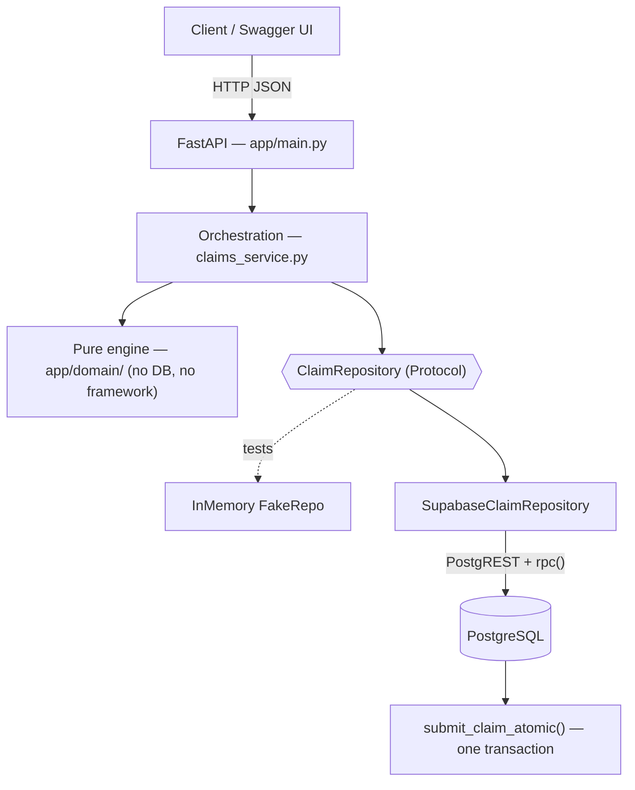

# Claims Adjudication Engine

[](https://github.com/Saurav02022/claims-processing-system/actions/workflows/tests.yml)

A backend that decides what a health-insurance claim actually pays. A claim is a set of **line items**; each line is adjudicated independently against the policy's coverage rules — covered or not, how much is payable, and **why** — and the line decisions roll up into a claim status. Members can dispute a decision and reviewers can complete a manual review; both re-adjudicate and keep a full audit trail.

The hard part isn't the arithmetic. It's that money has no partial credit — a rounding drift, a double-applied deductible, or a half-written claim all corrupt the record — and the client can't hold a transaction across calls. So the design is really about **where correctness is enforced**: a pure rules engine for the math, and the database for atomicity and every constraint that must never be violated.

FastAPI · Python · Supabase / PostgreSQL · Pydantic · pytest · *(Forward Deployed Engineer take-home)*

## Contents

1. [What it does](#what-it-does)
2. [Architecture](#architecture)
3. [Where things live](#where-things-live)
4. [How a line item is adjudicated](#how-a-line-item-is-adjudicated)
5. [Invariants the system holds](#invariants-the-system-holds)
6. [Data model & atomic submission](#data-model--atomic-submission)
7. [Design decisions (and the alternatives I turned down)](#design-decisions-and-the-alternatives-i-turned-down)
8. [API](#api)
9. [A worked claim](#a-worked-claim)
10. [Tests](#tests)
11. [Run it locally](#run-it-locally)
12. [Known limitations](#known-limitations)

---

## What it does

- **Submit a claim** with one or more line items (service type, date, billed amount).
- **Adjudicate each line** against the plan's coverage rules in a fixed order: policy validity → coverage → deductible → copay → coinsurance → annual money/visit limits → manual-review threshold.
- **Compute the payable amount** per line and **roll the line decisions up** into a claim status (`approved` / `partially_approved` / `denied` / `under_review`).
- **Explain every decision** with reason codes from a queryable taxonomy.
- **Track usage across claims** — deductible met, money used, visits used — via per-policy accumulators, so limits accumulate within a benefit period.
- **Dispute a line** or **complete a manual review** → a new, versioned re-adjudication; the prior one is kept.

## Architecture

Layered, with a **pure domain core** that has no database or framework import, so the rules can be reasoned about and unit-tested in isolation. The service depends on a `ClaimRepository` **Protocol**, which lets the whole API run offline against an in-memory fake and against Supabase for real.



The engine returns plain data; the service orchestrates and raises plain exceptions; `main.py` maps those to HTTP codes. Nothing but the repository talks to the database.

## Where things live

```
app/
  main.py               FastAPI app + the 6 routes; maps domain exceptions → HTTP codes
  schemas.py            Pydantic request/response models (the HTTP boundary + money serialization)
  claims_service.py     orchestration: load policy context, run the engine per line, thread
                        accumulators, persist, shape the response
  claims_repository.py  ClaimRepository Protocol + SupabaseClaimRepository (calls submit_claim_atomic via rpc)
  domain/
    adjudication.py     the pure engine: adjudicate_line_item(), roll_up_claim_status()
    models.py           frozen dataclasses, Decimal money — engine inputs/outputs, no persistence types
    enums.py            LineItemDecision, ClaimStatus, ReasonCode (mirror the DB CHECK constraints)
  config.py  db.py      settings + the Supabase client
supabase/migrations/    the schema — source of truth (5 SQL files, incl. the atomic function + hardening)
scripts/seed_demo.py    a demo plan/policy/coverage rules for a live walkthrough
tests/                  74 tests across engine, API, DB-constraint, and repository-integration
docs/                   domain-model.md · decisions.md · self-review.md · the assignment brief
```

If you only read two files, read `app/domain/adjudication.py` (all the business rules, ~170 lines) and `supabase/migrations/…_atomic_claim_submission.sql` (how a whole claim commits at once).

## How a line item is adjudicated

`adjudicate_line_item` (`app/domain/adjudication.py`) is a pure function of `(line, coverage rule, plan, accumulator, policy)`. **Precedence is deliberate and tested** — coverage before cost-sharing, limits before the review threshold:

1. **Policy validity** — inactive policy → `POLICY_INACTIVE`; service date outside the benefit period → `SERVICE_DATE_OUT_OF_COVERAGE`.
2. **Coverage** — no rule / `is_covered = false` → `NOT_COVERED`.
3. **Deductible** — apply the remaining plan deductible, capped at the covered amount → `DEDUCTIBLE_APPLIED`.
4. **Copay** — fixed copay, capped at the remainder so payable can't go negative → `COPAY_APPLIED`.
5. **Coinsurance** — `rate × remainder` → `COINSURANCE_APPLIED`.
6. **Limits** — visits used ≥ visit limit → `VISIT_LIMIT_EXCEEDED`; annual money limit exhausted → `ANNUAL_LIMIT_EXCEEDED`; otherwise cap the payable at what's left → `LIMIT_PARTIALLY_APPLIED`.
7. **Manual-review threshold** — `billed > threshold` → `NEEDS_REVIEW` (`OVER_REVIEW_THRESHOLD`).

A clean approval with no reductions is tagged `COVERED_IN_FULL`; every decision carries at least one reason. The **claim status** is a roll-up: any line in review → `under_review`; all approved → `approved`; all denied → `denied`; otherwise `partially_approved`.

## Invariants the system holds

These hold no matter what input arrives — some enforced in the engine, some by the database (so they survive a bug in the app):

| Invariant | Enforced by |
|---|---|
| `payable = covered − deductible − copay − coinsurance`, **floored at 0** (copay is capped at the remainder, so it never drives payable negative) | engine (`adjudication.py`) + `payable_amount >= 0` CHECK |
| **Money is `Decimal`**, rounded HALF_UP to 2 dp — no float anywhere in the calculation | engine; `NUMERIC(12,2)` columns; API serializes as fixed 2-dp strings |
| Coinsurance is a rate in `[0, 1]` | `NUMERIC(5,4)` + `CHECK (>= 0 AND <= 1)` |
| **Exactly one *current* adjudication per line** (re-adjudication versions, never overwrites) | partial unique index `adjudication (line_item_id) WHERE is_current` |
| A claim and **all** its line items, adjudications, reasons, history, and accumulators commit **atomically or not at all** | one `plpgsql` function in a single transaction |
| Status history is **append-only** | writes only ever `INSERT` into `*_status_history` |
| PHI (member name/DOB, provider, diagnosis) is **never returned in an API response or written to a log** | column-level isolation; responses shaped by `schemas.py`; engine logs decision + reason codes only |
| Every table is **deny-by-default**; only the server-side service role reads or writes | RLS enabled on all tables |

## Data model & atomic submission

PostgreSQL, UUID primary keys, money `NUMERIC(12,2)`, statuses as `text + CHECK` (see the trade-off below). Core tables: `plan` / `coverage_rule` (benefit design), `policy` / `member`, `accumulator` (materialized usage per benefit period), `claim` / `claim_line_item`, `adjudication` (+ `adjudication_reason`), the append-only `*_status_history` tables, and `dispute`.

The interesting write is submission. PostgREST can't wrap several writes in one transaction across calls, so a claim used to be written as a sequence of client calls — a mid-write failure could leave a claim with some line items and no accumulators. That whole write now lives in **one Postgres function**:

```sql
create or replace function public.submit_claim_atomic(payload jsonb)
returns uuid language plpgsql
security invoker set search_path = ''    -- runs as the caller; no mutable search path
as $$ ... $$;   -- inserts claim + status history + every line + adjudication + reason
                -- + line history + accumulators, all in one transaction

revoke execute on function public.submit_claim_atomic(jsonb) from public, anon, authenticated;
grant  execute on function public.submit_claim_atomic(jsonb) to service_role;
```

Called from the repository via `client.rpc(...)`. Either the whole claim lands or none of it does. The function is also hardened — pinned `search_path`, schema-qualified objects, and `EXECUTE` revoked from everyone but the service role.

## Design decisions (and the alternatives I turned down)

- **Coverage rules as typed relational columns, not a JSON blob or a rule DSL.** A DSL is more flexible, but columns map 1:1 to insurance concepts, are constrained at the DB level, and are explainable to a non-engineer. Flexibility I didn't need wasn't worth losing the constraints.
- **Adjudication is versioned, never overwritten.** A dispute or a review inserts a new `adjudication` row and flips `is_current`; `triggered_by` records `submission` / `dispute` / `review`. Overwriting would be simpler but would destroy the audit trail, which is the point of a claims system.
- **`text + CHECK` for statuses, not a Postgres `ENUM`.** Adding a value to a Postgres enum is a migration hazard; a `CHECK` is trivial to evolve. I traded a little type-purity for cheap schema evolution.
- **Supabase PostgREST + one atomic RPC, not a direct `psycopg` connection.** The project's direct Postgres host is IPv6-only (unreachable on typical IPv4 networks); the REST endpoint isn't. So I kept PostgREST for the simple reads and pushed the one write that *needs* a transaction into a database function, rather than take a hard dependency on direct connectivity.
- **Disputes are line-level (a target line is required).** A claim-level dispute would have no re-adjudication target and could strand a claim permanently in `disputed`; requiring `line_item_id` (422 otherwise) means every dispute is resolvable.
- **Validation at the HTTP boundary.** `billed_amount` is bounded to the `NUMERIC(12,2)` range in Pydantic, so oversized input is a `422`, not a `500` when the insert overflows.

Full write-up in [`docs/decisions.md`](docs/decisions.md); the domain model and ERD are in [`docs/domain-model.md`](docs/domain-model.md).

## API

Six endpoints. Money is returned as fixed 2-decimal strings (`"80.00"`); PHI is never echoed.

| Method | Path | Purpose | Success |
|---|---|---|---|
| `GET`  | `/health` | Liveness | `200` |
| `POST` | `/claims` | Submit + adjudicate a claim | `201` |
| `GET`  | `/claims/{id}` | Fetch a persisted, adjudicated claim | `200` |
| `POST` | `/claims/{id}/disputes` | Open a dispute on a line | `201` |
| `POST` | `/disputes/{id}/resolve` | Resolve → re-adjudicate the line | `200` |
| `POST` | `/claims/{id}/lines/{lid}/review` | Complete a manual review | `200` |

Errors are JSON `{"detail": …}`: `404` (policy/claim/dispute not found), `422` (unknown service type, line not in claim, or Pydantic validation), `409` (dispute already resolved, or line not awaiting review).

## A worked claim

With the demo data (`$200` plan deductible; PHYSIO copay `$20`/10 visits, DENTAL `$1000` limit/20% coinsurance, OPTICAL review threshold `$500`, MENTAL_HEALTH not covered):

```jsonc
POST /claims
{ "policy_id": "…", "line_items": [
  {"service_type_code": "PHYSIO",        "service_date": "2026-03-01", "billed_amount": 300},
  {"service_type_code": "DENTAL",        "service_date": "2026-03-02", "billed_amount": 500},
  {"service_type_code": "MENTAL_HEALTH", "service_date": "2026-03-03", "billed_amount": 80},
  {"service_type_code": "OPTICAL",       "service_date": "2026-03-04", "billed_amount": 600} ] }
```

→ `status: "under_review"`, `total_payable_amount: "1080.00"`:

| Line | Decision | Payable | Why |
|---|---|---|---|
| PHYSIO 300 | approved | `80.00` | `$200` to the deductible, then `$20` copay |
| DENTAL 500 | approved | `400.00` | 20% coinsurance |
| MENTAL_HEALTH 80 | denied | `0.00` | `NOT_COVERED` |
| OPTICAL 600 | needs_review | `600.00` | over the `$500` review threshold |

Completing the OPTICAL review takes the claim to `partially_approved`.

## Tests

**74 tests, and more test code than application code (≈1,516 vs ≈1,195 lines)** — the ratio is deliberate for money logic.

- **Engine** (pure, no DB): coverage, the deductible/copay/coinsurance ordering, limits, the review threshold, roll-up, rounding, the payable invariant, precedence, dispute determinism.
- **API + service** (`TestClient` + in-memory `FakeRepo`, offline): every flow, validation and error mapping, partial approvals, money formatting, PHI non-leakage.
- **DB-gated** (run only with `SUPABASE_URL` set): `test_schema_constraints.py` verifies the CHECK constraints, the one-current-adjudication index, and accumulator uniqueness against a real database; `test_repository_integration.py` drives the real repository end-to-end and seeds/deletes its own data.

```bash
pytest -q          # 64 offline tests
SUPABASE_URL=… SUPABASE_SERVICE_ROLE_KEY=… pytest -q   # + the 10 DB-gated tests
```

## Run it locally

Needs Python 3.11+ and a Supabase project (free tier is fine — the app talks to it over REST).

```bash
python3 -m venv venv && source venv/bin/activate
pip install -r requirements-dev.txt
cp .env.example .env          # add SUPABASE_URL and SUPABASE_SERVICE_ROLE_KEY
```

Apply the five files in `supabase/migrations/` in order (Supabase SQL editor), then seed and run:

```bash
python -m scripts.seed_demo   # prints a policy_id to submit claims against
uvicorn app.main:app --reload # API at :8000, Swagger at /docs
```

## Known limitations

Documented honestly (full list in [`docs/self-review.md`](docs/self-review.md)):

- **Claim submission is atomic; dispute-resolution and manual-review are not** — those are smaller single-line writes still done as sequential PostgREST calls.
- **Append-only history is a convention**, not yet enforced by a trigger or a revoke.
- **`quantity` is accepted but doesn't affect the math** — left undecided pending a real product rule rather than guessed at.
- **No auth, no payment step** (`paid` exists in the schema but is never produced), single currency — all out of scope for the exercise.
