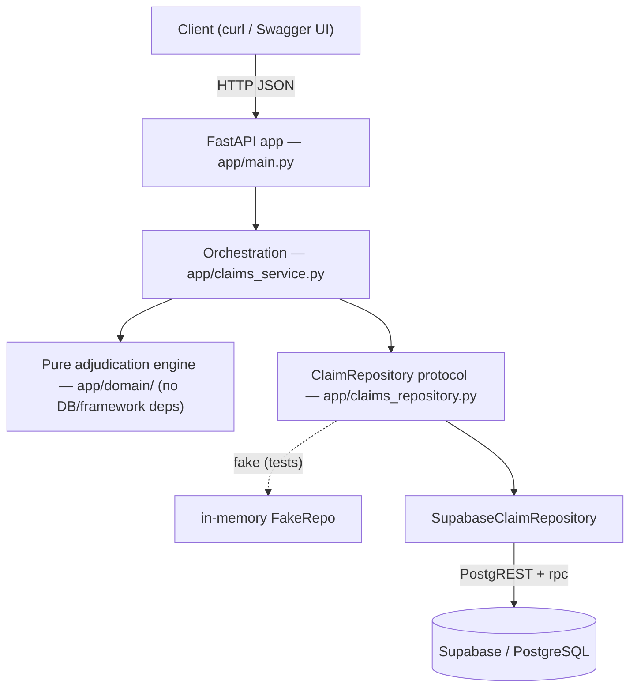
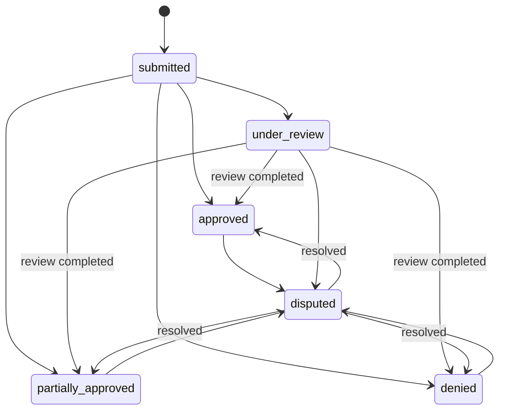

# Claims Processing System

A backend service that processes health-insurance claims. A member submits a
claim made of **line items**; the system **adjudicates each line independently**
against the policy's coverage rules — deciding whether it is covered, how much is
payable, and **why** — rolls the line decisions up into a claim status, tracks
each claim and line through its lifecycle, and lets a member **dispute** a
decision or a reviewer **complete a manual review** (both re-adjudicate and keep
a full audit trail).

Built with **Python + FastAPI** over **Supabase (PostgreSQL)**. The adjudication
logic is a **pure, dependency-free domain layer**; persistence and the HTTP
interface sit around it.

> Forward Deployed Engineer take-home. The assignment brief is in
> [`docs/problem_statement.md`](docs/problem_statement.md) and
> [`docs/candidate_assignment_instructions.md`](docs/candidate_assignment_instructions.md).
> Deeper design docs: [`docs/domain-model.md`](docs/domain-model.md),
> [`docs/decisions.md`](docs/decisions.md), [`docs/self-review.md`](docs/self-review.md).

---

## Contents

1. [What it does](#what-it-does)
2. [Architecture](#architecture)
3. [How adjudication works](#how-adjudication-works)
4. [Claim & line-item lifecycle](#claim--line-item-lifecycle)
5. [Project structure](#project-structure)
6. [Setup](#setup)
7. [Database setup](#database-setup)
8. [Run](#run)
9. [API reference](#api-reference)
10. [Example end-to-end flow](#example-end-to-end-flow)
11. [Tests](#tests)
12. [Design decisions & trade-offs](#design-decisions--trade-offs)
13. [Known limitations](#known-limitations)
14. [AI collaboration artifacts](#ai-collaboration-artifacts)

---

## What it does

- **Submit a claim** with one or more line items (service type, date, billed amount, optional diagnosis).
- **Adjudicate each line** against the plan's coverage rules, in a fixed order: policy validity → coverage → plan deductible → copay → coinsurance → annual money/visit limits → manual-review threshold.
- **Calculate the payable amount** per line and **roll the line decisions up** into a claim status (`approved` / `partially_approved` / `denied` / `under_review`).
- **Explain every decision** with reason codes (e.g. `NOT_COVERED`, `DEDUCTIBLE_APPLIED`, `ANNUAL_LIMIT_EXCEEDED`).
- **Track usage across claims** (deductible met, money used, visits used) via per-policy accumulators.
- **Dispute a line decision** → versioned re-adjudication against current rules.
- **Complete a manual review** of a `needs_review` line → the modeled exit from `under_review`.
- Every state change is recorded in **append-only status-history** tables.

| Signal | Where it lives |
|---|---|
| Domain decomposition | `app/domain/` (pure), `supabase/migrations/` (schema) |
| Rule representation | `coverage_rule` table — typed relational columns, not a DSL |
| State management | `claim.status` (roll-up) + `*_status_history` audit |
| Edge cases | partial approvals, limit exhaustion, retro re-adjudication |
| Explanation | `reason_code` taxonomy + per-decision messages |

---

## Architecture

Layered, with a **pure domain core** that has no database or framework
dependency — so the adjudication rules can be reasoned about and unit-tested in
isolation. The service depends on a `ClaimRepository` **protocol**, which lets the
whole API be tested offline with an in-memory fake and run against Supabase for
real.



- **`app/domain/`** — `adjudication.py` (the engine, a pure function), `models.py` (frozen dataclasses, `Decimal` money), `enums.py` (decisions, statuses, reason codes).
- **`app/claims_service.py`** — loads policy context, runs the engine per line, threads accumulators, persists via the repository, shapes responses. Raises plain exceptions; the API maps them to HTTP codes.
- **`app/claims_repository.py`** — the `ClaimRepository` protocol + the live Supabase implementation. Claim submission is written **atomically** via a Postgres function (`submit_claim_atomic`) called with `client.rpc(...)`.
- **`app/main.py`** — thin FastAPI layer; dependency-injects the repository.

---

## How adjudication works

`adjudicate_line_item` (`app/domain/adjudication.py`) is a **pure function** of its
inputs. Steps run in this order — **precedence matters** and is tested:

1. **Policy validity** — not `active` → `POLICY_INACTIVE`; service date outside the benefit period → `SERVICE_DATE_OUT_OF_COVERAGE`.
2. **Coverage** — no rule or `is_covered = false` → `NOT_COVERED`.
3. `covered = billed`.
4. **Deductible** — apply remaining plan deductible (capped at covered) → `DEDUCTIBLE_APPLIED`.
5. **Copay** — fixed copay, capped at the remainder → `COPAY_APPLIED`.
6. **Coinsurance** — `rate × remaining` → `COINSURANCE_APPLIED`.
7. **Limits** — visits used ≥ visit limit → `VISIT_LIMIT_EXCEEDED`; annual money limit exhausted → `ANNUAL_LIMIT_EXCEEDED`; otherwise cap payable at the remaining limit → `LIMIT_PARTIALLY_APPLIED`.
8. **Review threshold** — `billed > review_threshold` → `NEEDS_REVIEW` (`OVER_REVIEW_THRESHOLD`).
9. `payable = covered − deductible − copay − coinsurance`, floored at 0.

Money is `Decimal`, rounded **HALF_UP to 2 decimals**; the annual money limit caps
the *insurer-payable* amount (after cost sharing). A clean approval with no
reductions is tagged `COVERED_IN_FULL`. Every decision carries ≥ 1 reason.

**Reason-code taxonomy** (`reason_code` table):

| Category | Codes |
|---|---|
| Denial | `NOT_COVERED`, `POLICY_INACTIVE`, `SERVICE_DATE_OUT_OF_COVERAGE`, `ANNUAL_LIMIT_EXCEEDED`, `VISIT_LIMIT_EXCEEDED`, `MANUAL_REVIEW_DENIED` |
| Review | `OVER_REVIEW_THRESHOLD` |
| Adjustment | `DEDUCTIBLE_APPLIED`, `COPAY_APPLIED`, `COINSURANCE_APPLIED`, `LIMIT_PARTIALLY_APPLIED`, `COVERED_IN_FULL`, `MANUAL_REVIEW_APPROVED` |

---

## Claim & line-item lifecycle

The **line item** is the unit of adjudication; the **claim status is a roll-up** of
its line decisions:

- any line `needs_review` → `under_review`
- all `approved` → `approved` · all `denied` → `denied`
- a mix of approved/denied → `partially_approved`



A `needs_review` line is resolved by a reviewer (`.../review`); a disputed line is
re-adjudicated on resolve. Both write a **new versioned adjudication** (the prior
one kept for audit) and reconcile the accumulator. `paid` exists in the schema for
the future but is never produced (no payment step). Full state machines and the
ERD are in [`docs/domain-model.md`](docs/domain-model.md).

---

## Project structure

```
app/
  main.py              FastAPI app + routes
  schemas.py           API request/response models (Pydantic)
  claims_service.py    orchestration (submit, get, dispute, resolve, review)
  claims_repository.py  ClaimRepository protocol + Supabase implementation
  config.py / db.py    settings + Supabase client
  domain/              pure adjudication engine (no DB/framework deps)
    adjudication.py, models.py, enums.py
supabase/migrations/   SQL schema — the source of truth (5 migrations)
scripts/seed_demo.py   demo plan / policy / coverage rules for a live walkthrough
tests/                 engine, API, DB-constraint, and repository-integration tests
docs/                  domain model, decisions, self-review, assignment brief
ai-artifacts/          raw Claude Code session logs (AI collaboration evidence)
```

---

## Setup

**Prerequisites:** Python **3.11+** and a **Supabase project** (free tier is fine).
The app talks to Supabase over its REST API, so you need the project URL and the
service-role key. There is no offline/in-memory database mode — the running API
needs a real Supabase project (the test suite, however, runs offline; see [Tests](#tests)).

```bash
git clone <your-repo-url> claims-processing-system
cd claims-processing-system

python3 -m venv venv
source venv/bin/activate            # Windows: venv\Scripts\activate

pip install -r requirements-dev.txt # runtime deps + pytest

cp .env.example .env                # then edit .env (below)
```

Fill in `.env` (values from **Supabase Dashboard → Project Settings → API**):

```
SUPABASE_URL=https://YOUR_PROJECT_REF.supabase.co
SUPABASE_SERVICE_ROLE_KEY=YOUR_SERVICE_ROLE_KEY
```

`.env` is git-ignored — never commit it. The service-role key bypasses RLS; keep
it server-side only.

---

## Database setup

The schema lives in [`supabase/migrations/`](supabase/migrations) and is the single
source of truth. Apply them **in filename order** via the Supabase dashboard
**SQL Editor** (paste and run each file):

1. `20260604044439_baseline_schema.sql` — tables, constraints, RLS, triggers
2. `20260604044452_seed_reference_data.sql` — service-type catalog + reason codes
3. `20260604044802_schema_hardening.sql` — advisor fixes (indexes, `search_path`)
4. `20260604120000_review_completion.sql` — manual-review trigger value + reason codes
5. `20260604130000_atomic_claim_submission.sql` — the `submit_claim_atomic()` RPC

Then load a demo plan, coverage rules, member, and policy to submit claims against:

```bash
# from the project root, venv active, .env filled in
python -m scripts.seed_demo
```

It prints a `policy_id` to use in requests. The demo plan has a **$200 annual
deductible** and these rules: **PHYSIO** (copay $20, visit limit 10), **DENTAL**
(annual limit $1000, 20% coinsurance), **OPTICAL** (manual-review threshold $500),
**MENTAL_HEALTH** (not covered). Re-running the script is idempotent.

---

## Run

```bash
# from the project root, venv active
uvicorn app.main:app --reload
```

- API base: `http://127.0.0.1:8000`
- Interactive docs (Swagger UI): `http://127.0.0.1:8000/docs`
- Health check: `http://127.0.0.1:8000/health`

---

## API reference

Six endpoints. Money is returned as fixed 2-decimal strings (e.g. `"80.00"`).
Sensitive data (member name/DOB, provider, diagnosis) is **never** echoed in
responses.

| Method | Path | Purpose | Success |
|---|---|---|---|
| `GET`  | `/health` | Liveness check | `200` |
| `POST` | `/claims` | Submit + adjudicate a claim | `201` |
| `GET`  | `/claims/{claim_id}` | Fetch a persisted, adjudicated claim | `200` |
| `POST` | `/claims/{claim_id}/disputes` | Open a dispute on a line | `201` |
| `POST` | `/disputes/{dispute_id}/resolve` | Resolve a dispute (re-adjudicate the line) | `200` |
| `POST` | `/claims/{claim_id}/lines/{line_id}/review` | Complete manual review of a `needs_review` line | `200` |

**Error responses** (all JSON `{"detail": ...}`):

| Endpoint | Code | When |
|---|---|---|
| `POST /claims` | `404` | policy not found |
| | `422` | unknown service type, or validation (missing `policy_id`, empty `line_items`, `billed_amount` < 0 or over `NUMERIC(12,2)`, `quantity` ≤ 0) |
| `GET /claims/{id}` | `404` | claim not found |
| `POST /claims/{id}/disputes` | `404` | claim not found |
| | `422` | `line_item_id` missing/invalid, or not part of this claim |
| `POST /disputes/{id}/resolve` | `404` / `409` | dispute not found / already resolved |
| `POST .../lines/{id}/review` | `404` | claim not found |
| | `422` | `line_id` not in claim, or `decision` not `approved`/`denied` |
| | `409` | line is not awaiting manual review |

Request bodies (Pydantic-validated):

```jsonc
// POST /claims
{ "policy_id": "<uuid>", "provider_name": "...", "provider_identifier": "...",
  "line_items": [ { "service_type_code": "PHYSIO", "service_date": "2026-03-01",
                    "billed_amount": 300, "quantity": 1, "diagnosis_code": "..." } ] }

// POST /claims/{id}/disputes   (line_item_id is required)
{ "reason": "Mental health should be covered", "line_item_id": "<uuid>" }

// POST /claims/{id}/lines/{line_id}/review
{ "decision": "approved", "note": "optional reviewer note" }   // decision: approved | denied
```

---

## Example end-to-end flow

Using the `policy_id` printed by `seed_demo`:

```bash
curl -X POST http://127.0.0.1:8000/claims \
  -H "Content-Type: application/json" \
  -d '{
    "policy_id": "<POLICY_ID>",
    "line_items": [
      {"service_type_code": "PHYSIO",        "service_date": "2026-03-01", "billed_amount": 300},
      {"service_type_code": "DENTAL",        "service_date": "2026-03-02", "billed_amount": 500},
      {"service_type_code": "MENTAL_HEALTH", "service_date": "2026-03-03", "billed_amount": 80},
      {"service_type_code": "OPTICAL",       "service_date": "2026-03-04", "billed_amount": 600}
    ]
  }'
```

With the demo rules (deductible $200) this returns `status: "under_review"`,
`total_payable_amount: "1080.00"`, and four lines:

| Line | Decision | Payable | Reasons |
|---|---|---|---|
| PHYSIO 300 | `approved` | `80.00` | `DEDUCTIBLE_APPLIED`, `COPAY_APPLIED` |
| DENTAL 500 | `approved` | `400.00` | `COINSURANCE_APPLIED` |
| MENTAL_HEALTH 80 | `denied` | `0.00` | `NOT_COVERED` |
| OPTICAL 600 | `needs_review` | `600.00` | `OVER_REVIEW_THRESHOLD` |

Then resolve the review-flagged line (taking the claim out of `under_review`):

```bash
# OPTICAL line id comes from the submit response
curl -X POST http://127.0.0.1:8000/claims/<CLAIM_ID>/lines/<LINE_ID>/review \
  -H "Content-Type: application/json" -d '{"decision": "approved"}'
# -> claim becomes partially_approved (OPTICAL approved, MENTAL_HEALTH still denied)
```

Or dispute a decision (re-adjudicates that line against current rules):

```bash
curl -X POST http://127.0.0.1:8000/claims/<CLAIM_ID>/disputes \
  -H "Content-Type: application/json" \
  -d '{"reason": "Please re-check", "line_item_id": "<LINE_ID>"}'
curl -X POST http://127.0.0.1:8000/disputes/<DISPUTE_ID>/resolve
# -> outcome "upheld" if unchanged, "overturned" if the decision/payable changed
```

---

## Tests

```bash
# from the project root, venv active
pytest -q
```

- **Adjudication engine** — coverage, deductible/copay/coinsurance and ordering, annual/visit limits, review threshold, claim roll-up, rounding, payable invariant, rule precedence, dispute determinism (pure unit tests, **no DB**).
- **API + service layer** — `tests/test_api.py` drives the FastAPI app with an in-memory fake repository (**offline**): submit/get/dispute/review flows, validation and error mapping, partial approvals, money formatting, and PHI non-leakage.
- **DB constraints** — `tests/test_schema_constraints.py` verifies CHECK constraints, the one-current-adjudication index, accumulator uniqueness, and FK cascade against the live database.
- **Repository integration** — `tests/test_repository_integration.py` drives the real `SupabaseClaimRepository` end-to-end (submit → read-back, accumulators across claims, dispute resolve, manual review).

The engine and API tests need **no database or running server**. The last two are
**gated**: they run only when `SUPABASE_URL` + `SUPABASE_SERVICE_ROLE_KEY` are set,
and each seeds and deletes its own isolated data.

---

## Design decisions & trade-offs

Highlights (full detail in [`docs/decisions.md`](docs/decisions.md)):

- **Line item is the unit of adjudication;** claim status is a roll-up.
- **Coverage rules are typed relational rows** (`coverage_rule`), not a JSON blob or DSL — constrained at the DB level and explainable.
- **Adjudication is versioned, not overwritten** — re-adjudication (dispute or review) inserts a new row and flips `is_current`; `triggered_by` records `submission` / `dispute` / `review`.
- **Claim submission is atomic** — written in one transaction via the `submit_claim_atomic` Postgres RPC, so a mid-write failure rolls back cleanly.
- **RLS default-deny on every table;** only the server-side service role accesses data. PHI is isolated to named columns and never returned in responses or logs.

---

## Known limitations

Documented honestly (see [`docs/self-review.md`](docs/self-review.md)):

- **Dispute resolution / manual review write paths are still sequential** over PostgREST (claim submission is atomic; these smaller single-line writes are not).
- **Disputes are line-level** — `line_item_id` is required; there is no single claim-wide dispute action.
- **Aggregate overflow** — per-line `billed_amount` is bounded to `NUMERIC(12,2)`; a claim whose *total* exceeds that range is an untested edge.
- **No offline DB mode** for the running API, and migrations are applied manually (no Supabase CLI wired up).
- **`quantity` is accepted but inert** — a documented, undecided rule.
- **No authentication/authorization** and no payment step (`paid` is never produced) — out of scope.

**Out of scope** (per the brief): user registration/login, policy purchase/enrollment, member/provider management, notifications, dashboards, multi-role access control.

---

## AI collaboration artifacts

Raw Claude Code session logs are in [`ai-artifacts/`](ai-artifacts) as `.jsonl`,
covering framing/domain/schema, engine + API build, and review/QA/atomicity/docs
phases — per the assignment's AI-collaboration requirement.
