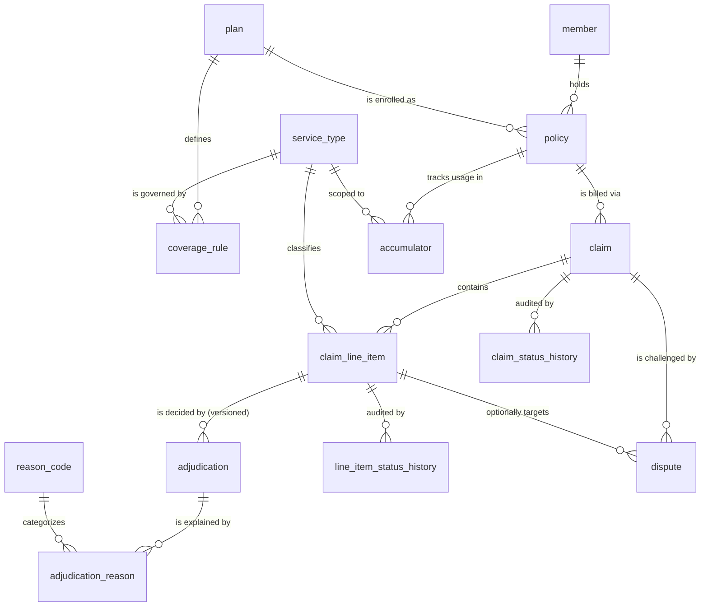
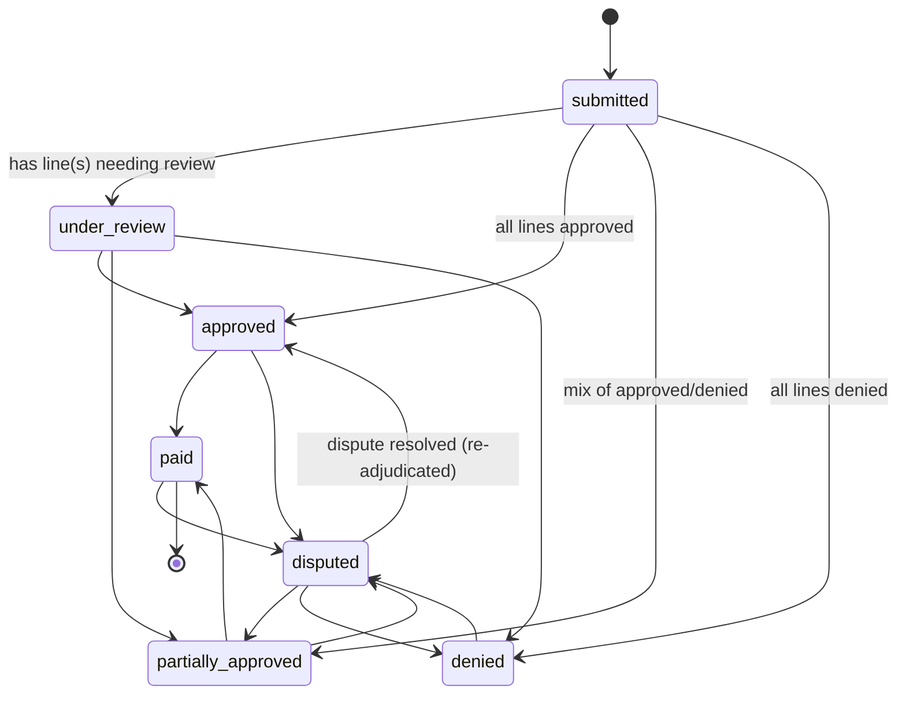
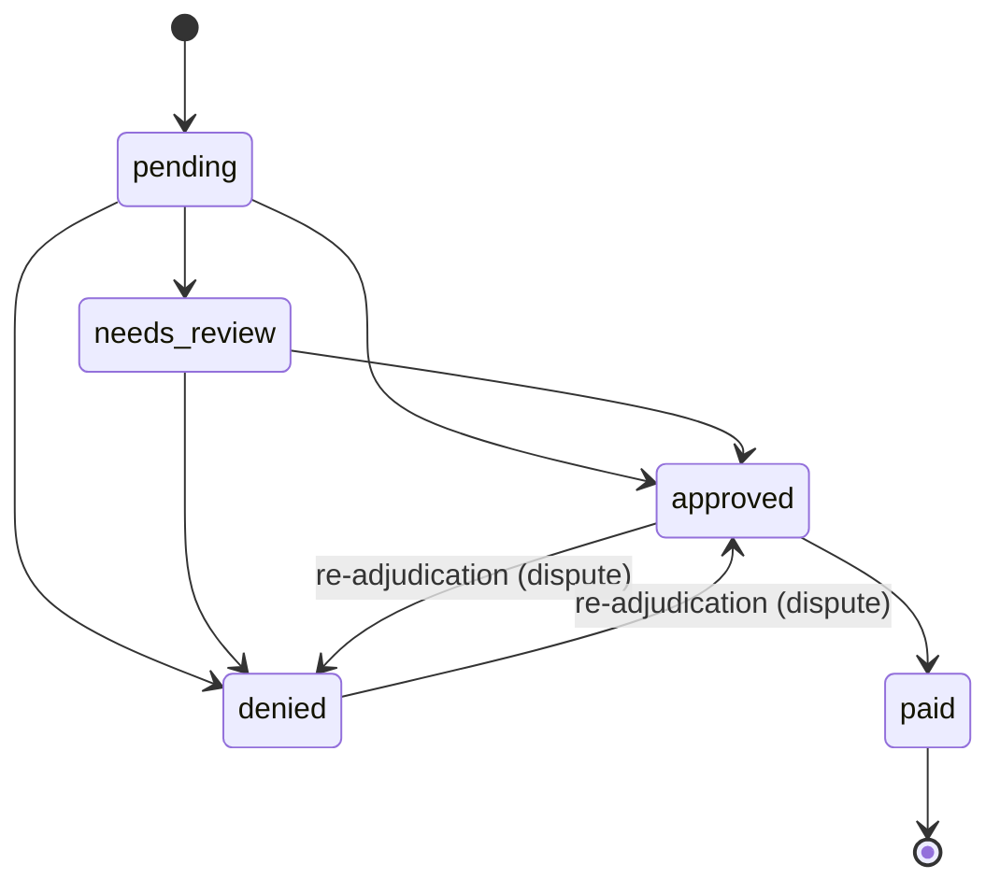

# Domain Model — Claims Processing System

> **Status: living design document.** This captures the current design intent before
> any SQL is written. It will evolve as we build. It is not final polished documentation.
> Stack: Python + FastAPI + Supabase (Postgres).

---

## 1. Purpose

A member holds a **policy** with **coverage rules**. They incur an expense and submit a
**claim** made of **line items**. The system **adjudicates each line item** (is it covered,
and how much do we pay?), tracks the claim and its line items through their **lifecycles**,
**explains every decision**, and lets members **dispute** outcomes.

The line item — not the claim — is the unit of adjudication. This single decision shapes the
whole model: partial approvals, per-service limits, and per-line explanations all fall out of it.

---

## 2. Intentionally out of scope

Not modeled, by assignment instruction. Building these would not improve the result:

- Authentication, login, sessions, multi-role access control
- Policy purchase / enrollment flows
- Member or **provider account management** (we still *store* provider details on a claim,
  we just don't manage providers as first-class records)
- Email / notifications / alerts
- Reporting dashboards or analytics
- Admin panels

---

## 3. Locked assumptions

To avoid re-opening decisions, these are assumed and treated as settled. Each can be revisited
if a requirement contradicts it.

1. **Plan layer is kept.** Coverage rules attach to a `plan` (a benefit design); a `policy` is a
   member's enrolled instance of a plan. This separates "what the product covers" from "who is
   enrolled" and lets multiple policies share one design. (Alternative — rules directly on policy —
   was rejected as less realistic and harder to extend.)
2. **Coverage dimensions in scope:** `is_covered`, annual money limit, annual visit limit, copay
   (fixed per visit), coinsurance (member %), a manual-review threshold, plus a **plan-level annual
   deductible**. Waiting periods, per-visit maximums, and out-of-pocket maximums are out of scope
   for now (additive later).
3. **Migrations are the source of truth**, stored as Supabase SQL migrations under
   `supabase/migrations/` and versioned in git. Remote migration history was reconciled to an empty
   baseline (see §13).
4. **Provider is denormalized** onto the claim (`provider_name`, `provider_identifier`) — no provider
   table, because provider management is out of scope.
5. **Single currency** (assume USD). Money is `NUMERIC(12,2)`; never floating point.
6. **No end-user auth**, so the FastAPI service is the only client and uses the Supabase service role.
   Row Level Security is still enabled default-deny on every table (defense in depth).

---

## 4. Main entities and why each exists

| Entity | Why it exists |
|---|---|
| `service_type` | Catalog of coverable services (GP visit, physiotherapy, dental…). The **join key** between coverage rules and line items. |
| `plan` | The benefit *design*: annual deductible + the set of coverage rules. Shared across policies. |
| `coverage_rule` | One row per (plan, service type): covered?, limits, copay, coinsurance, review threshold. The structured representation of coverage logic. |
| `member` | The insured person. Holds PHI (name, DOB). |
| `policy` | A member's enrolled instance of a plan, with effective dates and a benefit period (the accumulator window). |
| `claim` | A submission against a policy. Holds the **roll-up** status, provider details, and totals. |
| `claim_line_item` | A single billed service — the **unit of adjudication**. Holds billed facts + diagnosis (PHI) + current status. |
| `adjudication` | The decision for a line item: the money breakdown + outcome. **Versioned** so re-adjudication (after a dispute) preserves history. |
| `adjudication_reason` | The "why": reason code + human message + structured detail. Multiple reasons allowed per decision. |
| `reason_code` | Taxonomy of denial / review / adjustment reasons, so explanations are consistent and queryable. |
| `accumulator` | Usage against limits per (policy, service type, period): amount used, visits used, deductible met. |
| `claim_status_history` / `line_item_status_history` | Append-only audit of every state transition. |
| `dispute` | A member's challenge to a decision; linked to a claim and optionally a specific line item. Drives re-adjudication. |

---

## 5. Relationships (ERD)



**Cardinality notes**

- A claim has **1..N** line items; line items never exist without a claim (cascade delete).
- A line item has **1..N** adjudications over time; exactly **one is current**.
- A dispute always references a claim; the line-item reference is **optional** (claim-level vs line-level dispute).
- An accumulator row keys on (policy, service type, period); a nullable service type represents the
  policy-wide deductible accumulator.

---

## 6. Coverage rule modeling

**Decision: a typed relational `coverage_rule` table keyed by `(plan, service_type)`** — not a JSON
blob, not a generic rule engine, not a DSL.

Why:
- Typed columns map 1:1 to insurance concepts, so the adjudication math reads directly off the schema
  and is explainable in a pairing round.
- DB `CHECK` constraints (coinsurance in 0..1, non-negative money) reject bad rule data at write time.
- It's queryable and testable, matching the "tests encode domain rules" expectation.

Columns (conceptual): `is_covered`, `annual_limit_amount` (null = unlimited), `annual_visit_limit`
(null = unlimited), `copay_amount`, `coinsurance_rate`, `review_threshold_amount`,
`effective_from` / `effective_to` (rule versioning for retroactive-change scenarios).

The **annual deductible lives on `plan`** (a single deductible across services), not per rule.

**Adjudication math** (applied per line item, in order):

```
1. Match rule for (policy.plan, line.service_type, effective on service_date).
   - no rule OR is_covered = false      -> DENY  (reason: NOT_COVERED)
2. covered_amount = billed_amount
3. Apply remaining plan deductible      -> deductible_applied (member pays this part)
4. Apply copay                          -> copay_amount       (member pays)
5. Apply coinsurance on remainder       -> coinsurance_amount (member pays %)
6. Cap against remaining annual limit / visit limit
   - if limit already exhausted         -> DENY  (reason: ANNUAL_LIMIT_EXCEEDED / VISIT_LIMIT_EXCEEDED)
   - if partially remaining             -> APPROVE reduced payable (reason: LIMIT_PARTIALLY_APPLIED)
7. If billed_amount > review_threshold   -> NEEDS_REVIEW (reason: OVER_REVIEW_THRESHOLD)
8. payable_amount = covered_amount - deductible - copay - coinsurance, floored at 0
```

The math lives in **application code**, not the database. The schema stores the *inputs* (rules),
the *outputs* (adjudication breakdown), and the *reasons*.

---

## 7. Tracking usage against limits

**Decision: a materialized `accumulator` table**, updated within the same transaction that records an
adjudication; line-item adjudications remain the audit ledger.

- Key: `(policy_id, service_type_id, period_start)`. A row with null `service_type_id` holds the
  policy-wide `deductible_met_amount`.
- Tracks `amount_used`, `visits_used`, `deductible_met_amount`.
- Read during adjudication to know remaining limit/deductible; written after a decision is finalized.

Alternative considered: derive usage on the fly by summing approved payables. Rejected as the *primary*
mechanism because concurrent adjudication against the same limit needs a single row to lock and update
atomically. The ledger (adjudication rows) still allows full recomputation/reconciliation if drift is
ever suspected.

---

## 8. Claim lifecycle



Claim status is a **roll-up derived from its line items** and then persisted (so claims stay queryable
by status). `disputed` is a status overlay entered when a member opens a dispute and left on resolution.

---

## 9. Line-item lifecycle



The line item is authoritative. Each transition appends a row to `line_item_status_history`
(`from_status`, `to_status`, `reason`, `changed_at`, `changed_by`).

---

## 10. Partial approvals

Because adjudication is per line item, partial approval is the natural case, not a special one:

- Each line item gets its own `status` and its own current `adjudication` + reasons.
- The claim's roll-up is computed:
  - all lines `approved` → claim `approved`
  - all lines `denied` → claim `denied`
  - any line `needs_review` → claim `under_review`
  - otherwise (mix of approved/denied) → claim `partially_approved`
- `claim.total_payable_amount` = sum of current per-line `payable_amount`.

Example — 5 lines, 3 approved / 1 denied / 1 review → claim is `under_review` until the review line is
resolved, then `partially_approved`, with payable = sum of the 3 (then possibly 4) approved lines.

---

## 11. Adjudication & explanation storage

- **`adjudication`** is versioned per line item (`sequence` 1..N, exactly one `is_current = true`,
  enforced by a partial unique index). It stores the full money breakdown: `covered_amount`,
  `deductible_applied`, `copay_amount`, `coinsurance_amount`, `payable_amount`, the `decision`, and
  `triggered_by` (`submission` | `dispute`). Re-adjudication never mutates the prior row — it inserts a
  new one and flips `is_current`, preserving the original decision for audit.
- **`adjudication_reason`** holds one or more reasons per adjudication: a `reason_code` (taxonomy),
  a human `message`, and optional `detail` JSONB for structured numbers
  (e.g. `{ "limit": 1000, "used": 950, "requested": 200 }`). PHI must never go into `detail`.
- **`reason_code`** is the taxonomy: `code`, `category` (`denial` | `review` | `adjustment`),
  `default_message`. Examples: `NOT_COVERED`, `ANNUAL_LIMIT_EXCEEDED`, `VISIT_LIMIT_EXCEEDED`,
  `OVER_REVIEW_THRESHOLD`, `DEDUCTIBLE_APPLIED`, `COINSURANCE_APPLIED`.

This is how the system answers "why was this denied / reduced / sent to review?" for any line item,
at any point in its history.

---

## 12. Disputes

- A `dispute` references a **claim (required)** and **optionally a specific line item**, covering both
  "I dispute this whole claim" and "I dispute line 3 only" without an extra join table.
- Lifecycle: `open → under_review → resolved`, with `resolution_outcome`
  (`upheld` | `overturned` | `partially_overturned`).
- Resolving a dispute that overturns a decision triggers a **new `adjudication`** row
  (`triggered_by = 'dispute'`) and the corresponding line-item status transition — which is exactly why
  adjudication is versioned rather than overwritten.
- The member's free-text `reason` may contain health information and is treated as sensitive.

---

## 13. Conventions, PHI, and migration baseline

**Type & key conventions**
- UUID primary keys via `gen_random_uuid()` (`pgcrypto` already installed).
- Human-readable `claim_number` / `policy_number` for display (sequence-backed), separate from UUIDs.
- `created_at` / `updated_at` as `timestamptz default now()`; `updated_at` maintained by a
  `moddatetime` trigger.
- Status fields are `text` + `CHECK` constraints (easy to evolve in a migration) rather than Postgres
  ENUM types (which can't drop values and can't `ADD VALUE` inside a transaction). Lookup tables
  (`service_type`, `reason_code`) where referential integrity matters.
- Money `NUMERIC(12,2)`; coinsurance `NUMERIC(5,4)` with a 0..1 CHECK.

**Sensitive / PHI handling**
- PHI is isolated to specific columns and flagged in the schema: `member.full_name`,
  `member.date_of_birth`, `claim_line_item.diagnosis_code`, `claim.provider_name`,
  `claim.provider_identifier`, `dispute.reason`.
- RLS enabled default-deny on all tables; only the service role (server-side) reads/writes. The
  anon/publishable key must never touch these tables.
- PHI must not be written into `adjudication_reason.detail` JSONB or application logs.
- Column-level encryption (pgcrypto / Supabase Vault) is a deliberate **non-goal** for this assignment —
  noted so the trade-off is explicit.

**Migration baseline (reconciliation log)**
- The Supabase project arrived with a ghost migration record `20260603163415_create_claims_table` and
  **no corresponding table** (verified: `public` had zero tables). The record was removed so the
  migration ledger is empty and truthful. The first real migration we author will be the genuine
  baseline. Safe because there was no data.

---

## 14. Open / deferred (not blocking)

- Exact final reason-code list will firm up while writing adjudication tests.
- Whether `paid` is a manual transition or auto-set on approval — deferred until the lifecycle is wired;
  currently modeled as an explicit transition.
- Out-of-pocket maximum and waiting periods are deferred (additive columns if needed).
