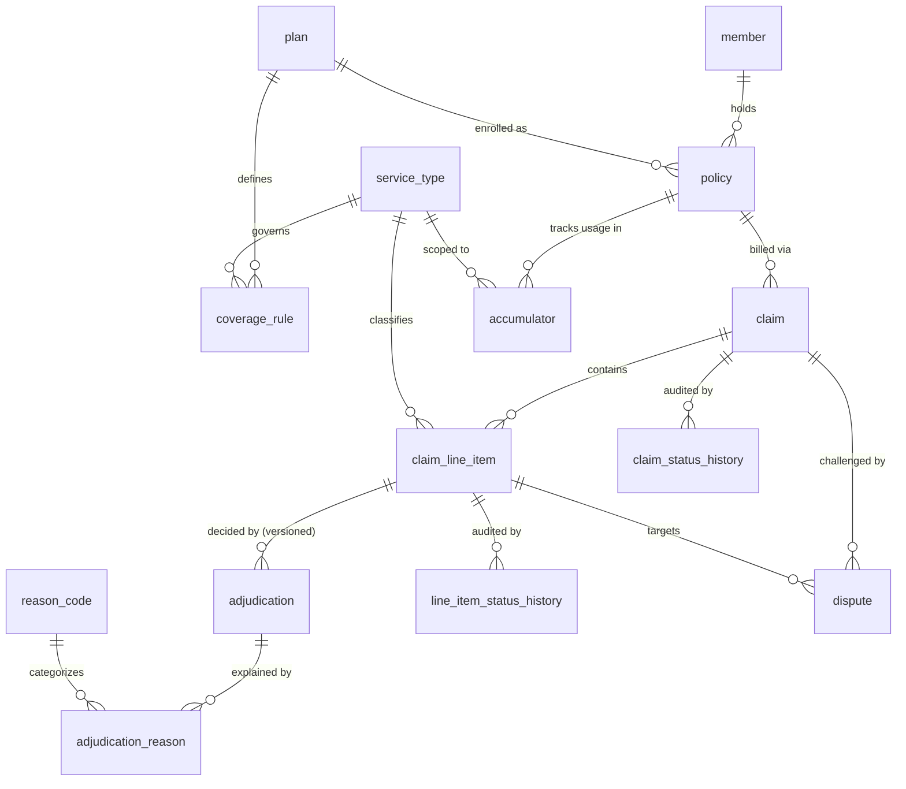
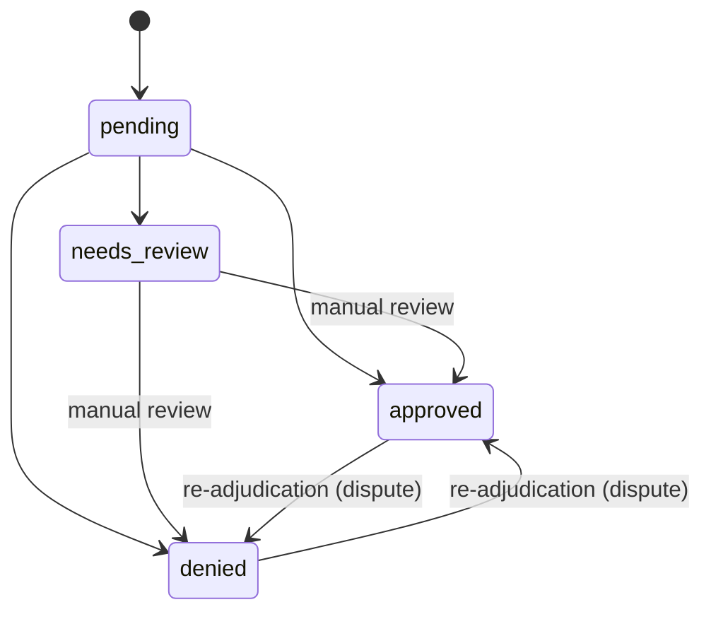
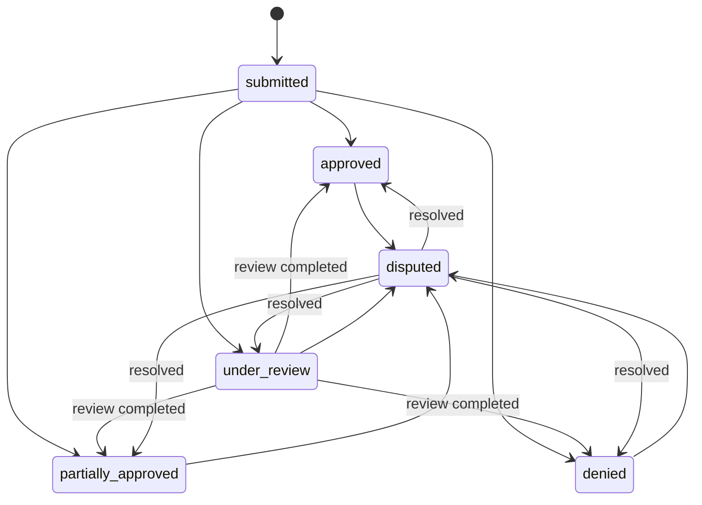

# Domain Model

How the Claims Processing System models the insurance domain: the entities, how
they relate, how a line item is adjudicated, and how claims and line items move
through their lifecycles. This describes the system **as implemented** — the SQL
migrations (`supabase/migrations/`) and the pure engine (`app/domain/`) are the
source of truth; this document follows them.

---

## Core idea

The **line item is the unit of adjudication**, not the claim. Each line item is
decided independently against the policy's coverage rules; the claim's status is
a *roll-up* of its line decisions. Partial approvals, per-service limits, and
per-line explanations all follow from this single choice.

---

## Entities

The schema has 14 tables in three groups, plus one Postgres function
(`submit_claim_atomic`) used for transactional writes.

**Reference / catalog**
- `service_type` — catalog of coverable services (e.g. `PHYSIO`, `DENTAL`,
  `OPTICAL`, `MENTAL_HEALTH`). The join key between coverage rules and line items.
- `reason_code` — taxonomy of explanation codes, each categorised
  `denial` / `review` / `adjustment`.

**Benefit design & enrollment**
- `plan` — benefit design; holds the plan-wide `annual_deductible_amount`.
- `coverage_rule` — one row per (plan, service type): whether covered, annual
  money limit, annual visit limit, copay, coinsurance rate, review threshold,
  effective dates. This is the structured coverage logic.
- `member` — the insured person (PHI: name, date of birth).
- `policy` — a member's enrolled instance of a plan, with effective dates, a
  benefit period (the accumulator window), and status (`active` / `terminated`).

**Claims & adjudication**
- `claim` — a submission against a policy; holds the roll-up status, provider
  details (PHI), and billed/payable totals.
- `claim_line_item` — one billed service on a claim; the unit of adjudication.
  Holds billed facts, diagnosis code (PHI), and current status.
- `adjudication` — the decision + money breakdown for a line item. **Versioned**:
  a line can have several adjudications (`sequence`), with exactly one `is_current`
  (enforced by a partial unique index). `triggered_by` is `submission`, `dispute`,
  or `review`.
- `adjudication_reason` — one or more explanations per adjudication (reason code +
  human message + optional JSONB detail).
- `accumulator` — usage consumed in a benefit period: a policy-wide row
  (deductible met) and per-service rows (amount used, visits used).
- `claim_status_history`, `line_item_status_history` — append-only audit of every
  status transition (from/to status, reason, actor).
- `dispute` — a member's challenge to a specific line decision, linked to a claim
  and a line item.

### Relationships

---

## Coverage rules

Coverage logic is modeled as **typed relational rows** in `coverage_rule` (not a
JSON blob or rule DSL), keyed by (plan, service type). The dimensions:

| Field | Meaning |
|---|---|
| `is_covered` | If false (or no rule) → the line is denied `NOT_COVERED`. |
| `annual_limit_amount` | Max insurer-payable per benefit period (null = unlimited). |
| `annual_visit_limit` | Max visits per period (null = unlimited). |
| `copay_amount` | Fixed member copay per line. |
| `coinsurance_rate` | Member's share (0..1) of the amount after deductible + copay. |
| `review_threshold_amount` | Billed above this → routed to manual review. |
| `effective_from` / `effective_to` | Rule validity window. |

The plan-wide deductible lives on `plan.annual_deductible_amount`.

---

## Adjudication algorithm

`adjudicate_line_item` (`app/domain/adjudication.py`) is a **pure function** of its
inputs (no DB / network / framework). Steps run in this order — **precedence
matters** and is enforced and tested:

1. **Policy validity.** Policy not `active` → deny `POLICY_INACTIVE`. Service date
   outside the benefit period → deny `SERVICE_DATE_OUT_OF_COVERAGE`.
2. **Coverage.** No rule, or `is_covered` false → deny `NOT_COVERED`.
3. `covered_amount = billed_amount`.
4. **Deductible.** Apply the *remaining* plan deductible
   (`plan deductible − already met`), capped at the covered amount →
   `DEDUCTIBLE_APPLIED`.
5. **Copay.** Apply the fixed copay, capped at the post-deductible remainder
   (so payable never goes negative) → `COPAY_APPLIED`.
6. **Coinsurance.** `rate × remaining` → `COINSURANCE_APPLIED`.
7. **Limits.** If visits already used ≥ visit limit → deny `VISIT_LIMIT_EXCEEDED`.
   If the annual money limit is already exhausted → deny `ANNUAL_LIMIT_EXCEEDED`.
   Otherwise cap payable at the remaining limit → `LIMIT_PARTIALLY_APPLIED`.
8. **Review threshold.** If `billed > review_threshold` → `NEEDS_REVIEW`
   (`OVER_REVIEW_THRESHOLD`).
9. `payable = covered − deductible − copay − coinsurance`, floored at 0.

An approval with no reductions at all is tagged `COVERED_IN_FULL`.

**Conventions:** money is `Decimal` rounded **HALF_UP to 2 decimals**; the annual
money limit caps the *insurer-payable* amount (i.e. after cost sharing).

### Reason codes (taxonomy)

- **Denials:** `NOT_COVERED`, `POLICY_INACTIVE`, `SERVICE_DATE_OUT_OF_COVERAGE`,
  `ANNUAL_LIMIT_EXCEEDED`, `VISIT_LIMIT_EXCEEDED`, `MANUAL_REVIEW_DENIED`.
- **Review:** `OVER_REVIEW_THRESHOLD`.
- **Adjustments:** `DEDUCTIBLE_APPLIED`, `COPAY_APPLIED`, `COINSURANCE_APPLIED`,
  `LIMIT_PARTIALLY_APPLIED`, `COVERED_IN_FULL`, `MANUAL_REVIEW_APPROVED`.

Every decision carries at least one reason — this is the explanation capability,
surfaced on each line in the API response.

---

## Line-item lifecycle

The engine assigns a **decision**: `approved`, `denied`, or `needs_review`, which
is persisted as the line's status. A `needs_review` line (billed over the rule's
review threshold) is resolved by a **reviewer** via
`POST /claims/{id}/lines/{line_id}/review`, which overrides the engine outcome to
`approved` or `denied` and writes a new adjudication version
(`triggered_by = review`). The schema's `claim_line_item.status` also allows
`pending` (the insert default, before adjudication) and `paid` (a payment step
that is out of scope and never produced by the current flow).

## Claim lifecycle

The claim status is **derived from its line decisions** (`roll_up_claim_status`):

- no lines → `submitted`
- any line `needs_review` → `under_review`
- all `approved` → `approved`
- all `denied` → `denied`
- otherwise (a mix of approved/denied) → `partially_approved`

Completing a line's manual review re-rolls-up the claim, so an `under_review`
claim can move to `approved` / `partially_approved` / `denied` (or stay
`under_review` if other lines are still pending review). Opening a dispute sets
the claim to `disputed`; resolving it recomputes the roll-up. (`paid` exists in
the schema but is not produced by the current flow.)

### Partial approvals

Because each line is decided independently, a claim with (say) one approved, one
denied, and one review line rolls up to `under_review`, and the claim's
`total_payable_amount` sums the per-line payables.

---

## Tracking usage against limits

Usage is materialized in `accumulator`, scoped to (policy, benefit period):
- the **policy-wide row** (`service_type_id = null`) holds `deductible_met_amount`;
- **per-service rows** hold `amount_used` (insurer payable) and `visits_used`.

On submission the service threads the deductible and per-service usage across the
claim's line items in memory (so a multi-line claim is internally consistent),
then **writes the updated accumulators back** so the deductible and limits carry
across claims. A `needs_review` line provisionally consumes usage (it has a
computed payable); that contribution is removed if the line is later denied on
review or dispute.

---

## Manual review

A line billed over its rule's `review_threshold_amount` is decided `needs_review`
rather than auto-approved, rolling the claim up to `under_review`. A reviewer
completes it via `POST /claims/{id}/lines/{line_id}/review` with
`{"decision": "approved" | "denied"}`:

- **Approve** keeps the money breakdown computed at submission (the threshold only
  flags for review; it does not reduce payable), drops the `OVER_REVIEW_THRESHOLD`
  flag, and records `MANUAL_REVIEW_APPROVED`.
- **Deny** zeroes the payable, records `MANUAL_REVIEW_DENIED`, and removes the
  line's prior contribution from the accumulator.

Like a dispute, this writes a **new adjudication version** (`triggered_by = review`,
the previous one marked `is_current = false`) plus a status-history entry, then
recomputes the claim roll-up and total. This is the modeled exit from
`under_review`.

---

## Disputes & re-adjudication

A `dispute` references a claim and a specific line item. `line_item_id` is
**required** when opening a dispute, so every dispute has a re-adjudication target
and the claim can never be left permanently `disputed`. (The DB column stays
nullable to allow claim-level disputes as a future extension.)

- **Open** (`POST /claims/{id}/disputes`): records the dispute (`open`) and sets
  the claim to `disputed`, with a status-history entry.
- **Resolve** (`POST /disputes/{id}/resolve`): re-adjudicates the disputed line
  against the *current* coverage rules, with the accumulator base excluding that
  line's own prior contribution. A new `adjudication` row is inserted
  (`sequence + 1`, `is_current = true`, `triggered_by = dispute`) and the previous
  one is marked `is_current = false`. The claim status and total are recomputed.
  The outcome is `overturned` if the decision or payable changed, else `upheld`.

Versioned adjudication (rather than overwrite) is what makes this auditable.

---

## Sensitive data (PHI)

PHI is isolated to specific columns: `member.full_name`, `member.date_of_birth`,
`claim.provider_name`, `claim.provider_identifier`,
`claim_line_item.diagnosis_code`, and `dispute.reason`. RLS is enabled
(default-deny) on every table; only the server-side service role accesses data.
API responses do not echo PHI (the `ClaimOut` / `LineItemOut` shapes exclude it),
and logs record only identifiers / status / counts.

## Conventions

- UUID primary keys (`gen_random_uuid()`); human-readable `claim_number` /
  `policy_number` for display.
- Money is `NUMERIC(12,2)`; coinsurance `NUMERIC(5,4)` constrained to 0..1.
  API responses serialize money as fixed 2-decimal strings.
- Status columns are `text` + `CHECK` (easy to evolve in migrations); lookups
  (`service_type`, `reason_code`) are tables for referential integrity.
- Timestamps are `timestamptz`; `updated_at` is maintained by a trigger.

## Out of scope

Authentication, policy purchase / enrollment, member or provider management,
notifications, dashboards, and multi-role access control. Provider details are
stored on a claim, but providers are not managed as their own records. The `paid`
states exist in the schema for the future but are never produced (no payment step).
